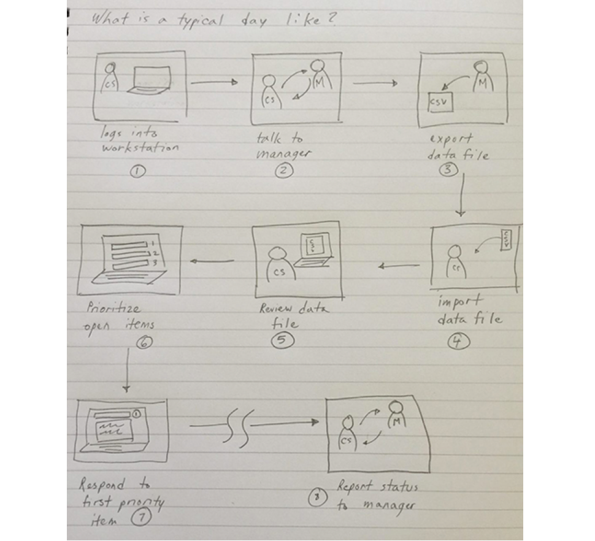
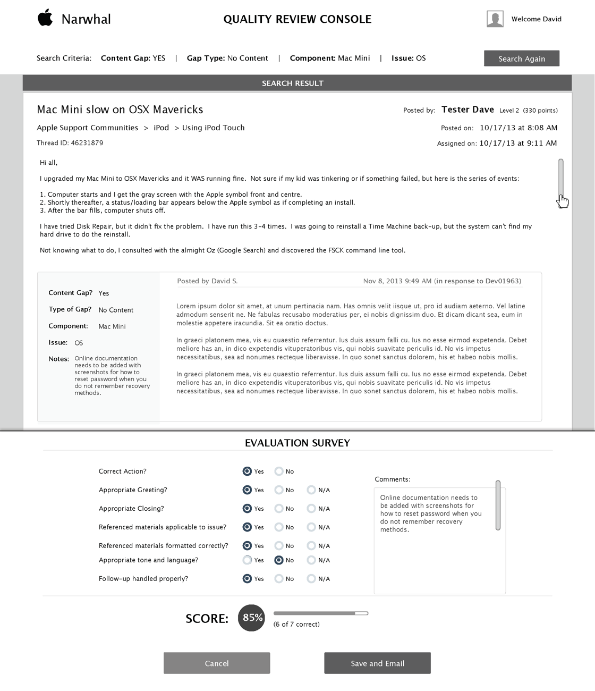
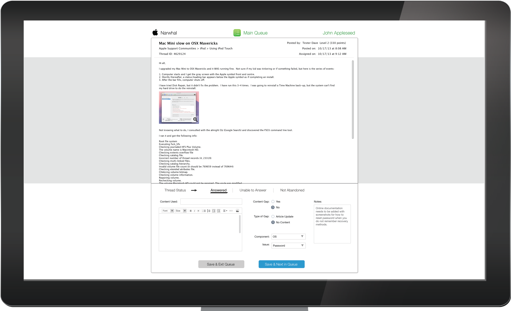

<table>

<tr>

<td></td>
<td></td>
<td></td>

</tr>

</table>

<table class="post-navigation">

<tr>

<td><i class="fab fa-readme"></i> &nbsp;Read the story below</td>
<td><i class="fas fa-angle-double-down"></i> &nbsp;<a href="#spoilers" target="_self">Jump to spoilers</a> </td>

</tr>

</table>

### Background
Apple’s Online Support team lacks an organized process for managing conversations that have stalled or gone unanswered. Over 7 million unique visitors directly visit the Online Support forums called Communities every month. Much of these inquiries were discovered and managed manually.

<table class="post-navigation">
<tr>
<td class="half">
	<h6>Cast (Team)</h6>
	<ul class="project-details">
		<li>Product Design Lead (me)</li>
		<li>UX Designer</li>
		<li>Product Manager</li>
		<li>Full Stack Engineer</li>
		<li>Director of Customer Support</li>
		<li>Product Experience Manager</li>
	</ul>
</td>
<td class="half">
	<h6>Audience (Users)</h6>
	<ul class="project-details">
		<li>Internal Customer Support Professionals</li>
		<li>Apple Product Users</li>
	</ul>
</td>
</tr>
</table>

### Story
I joined the Online Support team as their design lead for this effort and without much structure so I got engaged in the entire product lifecycle.

#### Stepping into Product Management

<table>
<tr>
<td class="half"></td>
<td>

My first thought was to get to know my users better. Business analysts were conducting interviews with the management stakeholders and I got myself invited. As we ran through these, I felt the actual specialists were getting ignored so I interviewed them on my own for a more holistic picture.

</td>
</tr>
</table>

I took copious notes through all conversations to get a sense of what features management needed. I also looked through all the documentation that the analysts were putting forth to find commonalities. 

There were themes I found and it was not different across different types of users. Themes for management were about increasing efficiency. Themes for employees were about increasing collaboration.

I thought it was hard to really share my notes this way so I needed to visualize it a bit more.

#### Profiling Users

In order to build a consensus, I decided to pull together User Profiles (more apt here than Personas) since the real world users were easily identifiable. I added demographics, environment, tasks, and goals to differentiate them.

#### What a Typical Workday like?

<table>
<tr>
<td class="half"></td>
<td>

The project manager began writing requirements for documentation purposes.  I thought it was too early but since Apple was still fairly waterfall, I didn’t want things to get too set in stone without my research findings.

I iterated the document with him and the analysts to get some user focused perspective added into the document. Since I love stories, I try to create a storyboard in the day of the life of my users.

</td>
</tr>
</table>

<table>
<tr>
<td>
<h4>Taking a bird's eye view of it all</h4>

I helped run the formal kickoff meetings with the entire project team to review current findings. As people usually are, there was great engagement to start thinking how the process flow would actually work. 

</td>
<td class="half">

</td>
</tr>
</table>

<table>
<tr>
<td>

</td>
<td class="third">

Iterating off the whiteboard, I applied the conversation and past research into how the user flows would look for specific use cases. I like to also put them side by side for different types of users so I can find some overall patterns.

</td>

</tr>

</table>

<table>

<tr>

<td class="half">
<h4>Bird flies in a bit closer</h4>

I started thinking about each screen and smaller details and would sketch a diagram for one of the pages to break down interaction into smaller detail:

<ul>
<li>User flows entering the screen</li>
<li>User flows within the screen</li>
<li>User flows leaving the screen</li>
</ul>

I thought of a conveyor belt where users can stay fixed on a rotating display of issues for maximizing efficiency.

</td>
<td>

</td>

</tr>
</table>

#### Building out Screens

Turning raw clay to statue, I approach that process in generating polished wireframes through countless iteration.

I initially tried to share rough drafts without polishing the document but my Apple stakeholders reacted more thoughtfully when it looked more complete. 

This was more work up front but ultimately led to the feedback I needed. 

One battle I had to fight for was the utilization of some real time data through certain screens of the application.

Engineering opposed it due to the tax it would have on the servers.  I had to bubble up my findings from interviews and rally stakeholders to emphasize it’s value.  

We had to compromise the number of graphs and data points so there was a very limited display for the web app.

I offered to take on the visual design tasks and crafted the migration of the work into the Adobe Creative Suite. I adhered to the Apple style guide as much as possible but had my own chances to veer off it slightly since this was an internal app. In addition to coming up with the visual design, I created an app icon as representation of each section to give the simple UI some pops of flair.

#### Handing off to Developers

After iteration on mockups were done, I led discussions with the Engineering team by doing a walkthrough on all documentation.

I stayed engaged to address questions during initial phases of development to show they had an ally in the project.

Glitches can occur during development so all the planning in the world can still result in iterations.

The team had found it difficult to translate my points as specified in the mockups and preferred to use pixels. It caused for some confusion on how to build a relationship between all the sizes so I went through and converted all specs to pixels. This didn’t add much delay to the project and we were able to keep to schedule.

<table>
<tr>

<td class="half">
The application has moved into production and now is being utilized by the team worldwide.  
  
Results show productivity has increased by 15% as of now and this should only increase as the team gets better acclimated to the tool.
</td>
<td>

</td>

</tr>
</table>

#### Turning Japanese

The project was very successful since the feedback from the Online Support team was resoundingly positive.

I left the project to at completion to start another gig. As I was exiting, I was asked to stay for phase 2 of the application. Being loyal, I could not back out of my new project as I already had a commitment.

One thing I was able to still work with them for phase 2 was to provide updates regarding localization. The Japanese team would be the next team to utilize the tool and thus I worked with a Japanese resource to build out a style guide just for them.

#### Leaving With An App

Due to the fact that I was a team player, the developers started to be open to putting data into the app somehow.

One of the compromises that we were able to come up with was to incorporate more graphs into a tablet version of the app. For some reason, this could be served by a different mechanism than the web app. This was a good solution because it is only used by management and through my discovery, I had found they liked using iPads as they move between offices and teams.

### Resolution
The Apple customer support team was very grateful for the attention to their needs and requested me to join a new initiative to take the project to the next level 6 months later. Alas, I was already occupied on another role but grateful for the ask.

<h3 id="spoilers">Spoilers</h3>

