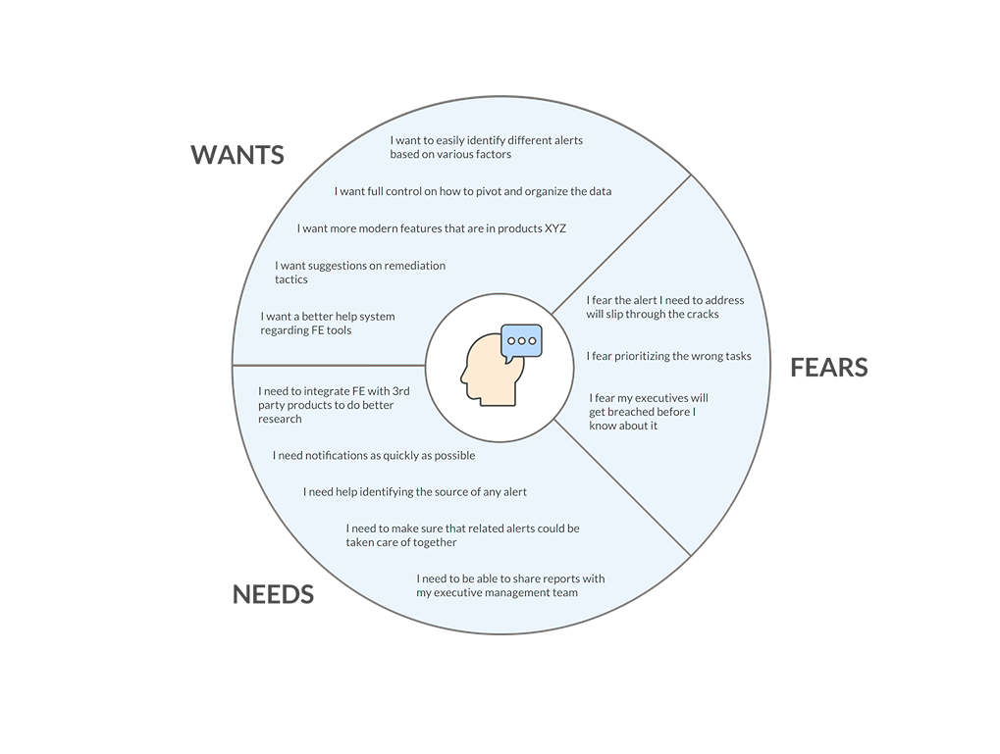
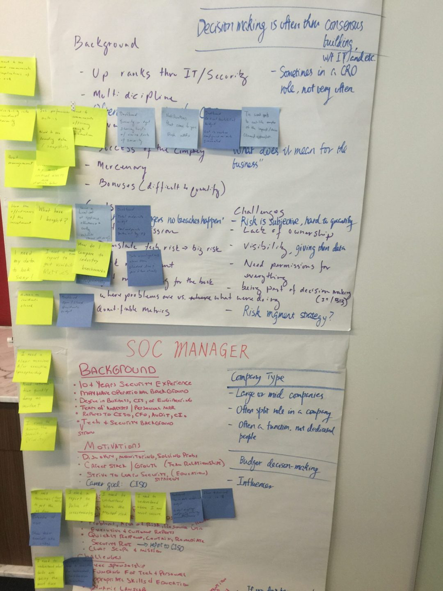
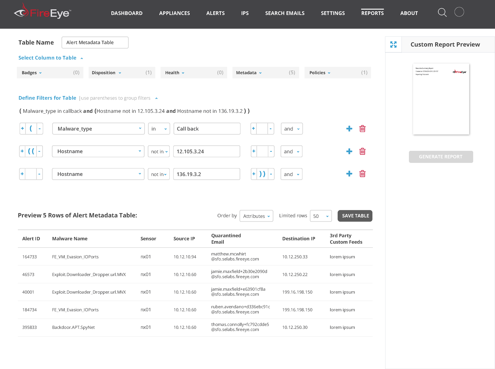

<h4>{{ page.title }}</h4>

<i class="fab fa-readme"></i> &nbsp;Read the story below

<a href="#spoilers" target="_self"><i class="fas fa-angle-double-down"></i> &nbsp;Jump to spoilers</a>

### Prologue

Cybersecurity is more critical now than ever before, and depending upon when you read this, it has probably become even more critical. The industry is managed by teams who are overworked and understaffed and rely on the best tools to keep their companies from being impacted by the latest virus or phishing scandal.

FireEye provides one of those tools for enterprise customers all over the world.

### Conflict

FireEye's main front end framework for its on-premise network security products had not evolved since the company's inception ten years prior, and although their tools detected threats well, tired security analysts were becoming overwhelmed with the volumes of data being shared with them.

### Main Character

I managed a team of designers during a time when our core product's roadmap was about to go through some major upheaval to pivot to user needs. 

	

		<h6>Cast (Team)</h6>
		<ul class="project-details">
			<li>Product Design Manager (me)</li>
			<li>Senior Designer</li>
			<li>Front-end Developer</li>
			<li>Director of Engineering</li>
		</ul>
	

	

		<h6>Specifications</h6>
		<ul class="project-details">
			<li>Adobe Creative Suite</li>
			<li>Responsive Design</li>
			<li>User Research</li>
			<li>Paper Prototyping</li>
			<li>Contextual Inquiry</li>
			<li>Whiteboard Brainstorm Sessions</li>
		</ul>
	

#### Empathy is always the starting point

<!-- FireEye's user interfaces were antiquated but I performed an audit on all of the current interfaces to understand what was and was not working well from a usability standpoint. I took notes as I went along since the interfaces are deep and complicated. 
-->

<!-- Security professionals have a high pressure job and if they let even one threat sneak into their network, it could wreak havoc on the whole company. Since there is also a shortage of good analysts to do these jobs, the ones who do have them require increasingly robust tools to  need for their tools to not stand in their way.
-->

FireEye's on-premise security product was really strong tool for detecting threats on the networks of it's customers. In fact, it became too strong and began to overwhelm the analysts who had to monitor them. 

Due to this, security analysts needed the tool to be easier to use. Their employers required them to protect their network and share input about what was happening at any given notice. Since I was going to do a redesign anyway, I also performed heurestic analysis of the current user interface to see how easy it was to perform some basic tasks. Answer? Not easy at all.

<!--I needed to better understand how users interacted with our product in their day to day jobs yet it was hard to lock down a lot of past research on the matter. To help my brain explore this narrative, I storyboarded a typical day based
on what I could dig up.
-->

You can't design for someone unless you try to live in their shoes to know all the ins and outs of the job. It is imperative to speak to the people on the front line. I created an interview script to put in front of them but first had to sell this concept internally as user research at FireEye was not something anyone was used to doing.

The story of how these analysts used the tools was becoming more clear but I would sketch storyboards on whiteboards to visually think it out. I also grabbed a designer on my team when available to validate steps.

#### What keeps our users up at night

After analysis of the observation, interviews, and performing competitive research, it was more clear what these analysts needed to perform their jobs.

They needed tools to have the following traits:
>* Easy identification of the most critical threats
* Provide ability to be proactive to potential threats
* Incorporate prioritization based on what is important to the organization 

#### Leading ideation efforts

We looked through our data and identified user personas across our product line. Based on these roles, we did some brainstorming on how product features could help each of them. 

#### KISS comes into play

No, not what you are thinking. K.I.S.S. as in Keep It Simple Stupid (one of design's original paradigms). 

Feeling the plight that analysts are generally overwhelmed, our design team brainstormed concepts surrounding simplifying the mental load a user must take to use FireEye tools while also giving them better insight and power. 

We saw that there were different types of alerts and based on the type, they fit into different categories so we started to find commonalities. We introduced a feature that bundled alerts into containers and called them Investigations. These Investigations also included unique new features based on what we thought would empower Analysts.

#### Investigations come alive

It was time to put together a few mockups so that we could collaborate with the broader Engineering team first. Our concepts required a few iterations and we ended up creating over 100 wireframes. 

#### Getting others in the game

Investigations resulted in over 50 unique screens that strung together into a cohesive flow which took our entire team weeks upon weeks to get right. We would iterate with the rest of the Engineering and Product teams as our makeshift end users after reviewing all our findings with them. We collected copious amounts of feedback via sticky notes and there wasn't enough table space to review it all!

#### A problem surfaces!

I shared our designs with the users I interviewed earlier through an interactive prototype in Axure. It was discovered during our observations with them that the Investigations concept had gone too far. Each user was hesitant to abandon the existing Alerts experience for fear of missing anything important due to transitioning to something new.

#### Crawl and not run to Investigations

After reviewing feedback internally, we decided to not pivot users into the Investigations experience but start to bleed
some much needed features into the existing Alerts experience instead. You can think of the new approach based on this
modified graphic.

Alerts did not get bundled into an Investigation and we did not even move the link to a new place in the navigation menu. We took baby steps to Investigations by making Alerts smarter.

One of the smarter features was including a timeline graph so that it made it visually easier to spot Alerts of a similar type in one row. In addition, it provided ability to identify the spatial relationship of other Alert types to find correlations, something that would have been covered under Investigations.

This posed some UI challenges and I did some sketches to test it out with team members.

The new Alerts experience was formalized into prototypes and presented to the Engineering teams in a mini roadshow. This tool would be giving users better insight without forcing them into a brand new paradigm.

<video width="100%" height="600" controls><source src="../images/story-fireeye-12c.mp4" type="video/mp4"></video>

#### Analysts can talk to their executive team!

One item that we captured through research about the complicated interfaces of past FireEye products was how hard it was for Analysts to share information about their job with their executive management. We decided since we toned down Investigations, we would add a new feature so they could do just that and it was simply called Reports. 

With additional input from real world users and internal architects, I concocted a Reports feature that would be capable of use UI components to could generate complex SQL queries needed to generate detailed reports.

<!--  -->

#### Conclusion

> After we tested with both new and returning security analysts, we got enthusiastic confirmation that the new feature would be greatly appreciated without any further changes. This gave me confidence to give it to Engineering for a green light to implement as FireEye's first official redesign of their on-premise networking user interface.

#### One More Thing...

When we had approval to move forward with development, we had to create a better system of documenting features as part of handoff to engineering. I had been introduced to Brad Frost’s Atomic Design concept and felt it was the perfect model to follow for our small team. This especially worked for me as I have a life science degree!

Our team went through all existing interfaces to label patterns that were Atoms, Molecules, and Organisms to help Engineers learn how to apply styles across the various components that they were to build. We also documented
the design system on internal wiki pages and flushed it out with some additional documentation such as microinteractions.

Before development was complete, FireEye's Marketing team had done some rebranding and thus we made changes to our mocksas I feel that brand harmony makes for a holistic experience for external users.

#### Epilogue

>* FireEye approved the first updated Alerts experience for it's on-premise products since the company’s inception
* FireEye established an improved design culture involving user research
* FireEye created it's full company wide design system for faster iteration to meet customer needs

---

### Spoilers

