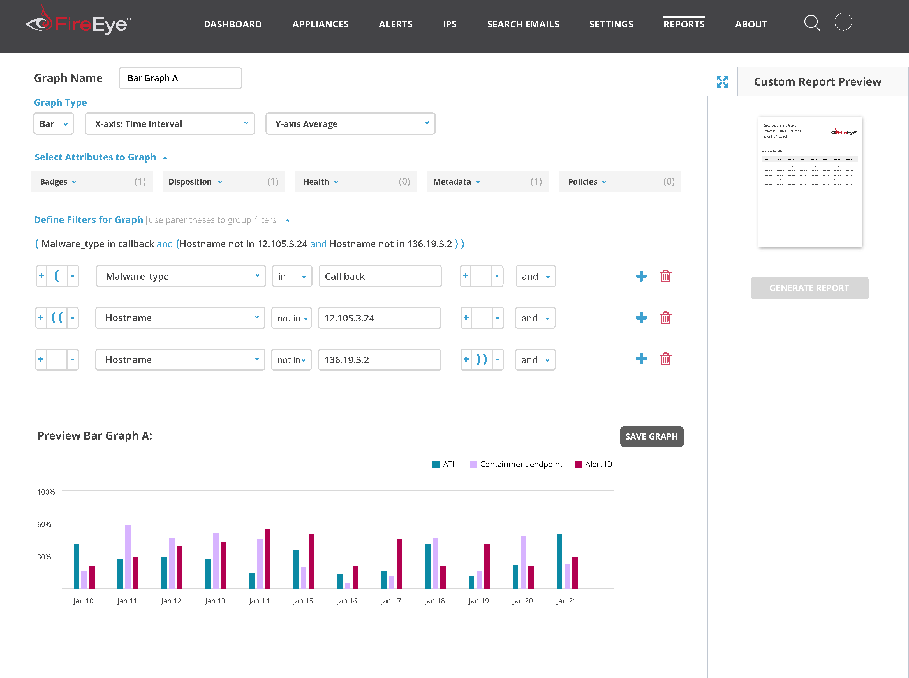
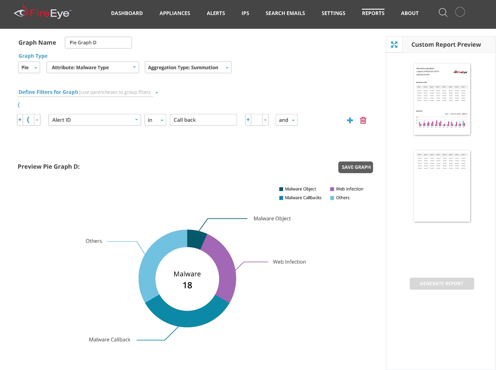

<table>

<tr>

<td></td>
<td></td>
<td></td>

</tr>

</table>

<table class="post-navigation">

<tr>

<td><i class="fab fa-readme"></i> &nbsp;Read the story below</td>
<td><i class="fas fa-angle-double-down"></i> &nbsp;<a href="https://www.screenplay.design/project/fireeye.html#spoilers" target="_self">Jump to spoilers</a> </td>
</tr>

</table>

&nbsp;

### Background

FireEye is a top contender in the new wave of cybersecurity upstarts who are changing how enterprise companies think of protecting their most important assets.

### Problem

FireEye’s main front end framework had not changed since the company’s inception 10 years ago and in order to keep up with the competition and meet customer requests, a new refresh on a new platform had to be built.

### My Involvement

I joined the small team of designers as the lead during a tumultous time when the product roadmap was about to go through some major changes. As a manager of design, I redesigned FireEye's appliance network security products so that their global customer base became more adept at handling threats. In addition, I helped push the department into become more design focused.

#### Empathy is always the starting point

FireEye's user interfaces were antiquated but I performed an audit on all of the current interfaces to understand what was and was not working well from a usability standpoint. I took notes as I went along since the interfaces are deep and complicated.

#### What a security analyst does

I needed to better understand how users interacted with our product in their day to day jobs yet it was hard to lock down
a lot of past research on the matter. To help my brain explore this narrative, I storyboarded a typical day based
on what I could dig up.
              
Nothing is more raw than actually talking to users so I fought to get in front of them and have them walk me through how
they use FireEye’s products. Although this was a process I had to define from scratch, I was able to speak to
5 customers and help put together a presentation for the entire department to review.

#### What keeps our users up at night

Through what has been collected thus far, I put together the key insights I wanted to address for a redesign.

#### Leading ideation efforts

We looked through our data and based on the roles that we had identified, we did some brainstorming on how product features
could help each type of user based on the collective fears, needs, or wants that had been defined. This also
lead us into discussion about actual interface elements based on the features.

#### New concept is born

Our design team brainstormed a few concepts that needed to be evaluated such as giving users better insight and control over their security landscape. We came up with new features that would help in these regards. The features were introduced
as a container for multiple alerts called Investigations and each would contain many advanced features.

#### Investigations come alive

It was time to put together a few wireframes so that we could collaborate with the broader Engineering team. Our concepts
required a few iterations and we had ended up creating over 100 wireframes including the features we wanted to
incorporate.

#### Getting others in the game

Investigations resulted in over 50 unique screens that strung together into a cohesive flow which took our entire team weeks upon weeks to get right. We would iterate with the rest of the Engineering and Product teams through collection
of feedback via sticky notes. Sometimes there wouldn’t be enough table space to review it all!

### A problem surfaces 

I shared our designs with the users I researched earlier via an interactive prototype in Axure. It was discovered that there were problems with the Investigations concept. Each user was hesitant to abandon the existing Alerts experience for fear of missing anything important due to transitioning to something new.

#### Smoother guide to Introductions

After reviewing feedback internally, we decided to not pivot users into the Investigations experience but start to bleed
some much needed features into the existing Alerts experience. You can think of the new approach based on this
modified graphic.

The new alerts experience was introduced with some of the features of Investigations without making users learn a new experience.
Giving users better insight was a key focus on features that were prioritized into this earlier release.

<video width="100%" height="360" controls><source src="../images/story-fireeye-12c.mp4" type="video/mp4"></video>

#### Becoming Atomic

When we had motion to move forward with development, we had to create a better system of documenting features. I had been
introduced to Brad Frost’s Atomic Design concept and felt it was the perfect model to follow in terms of production.
This especially worked for me as I have a life science degree!

Afterwards, we also made edits to the fonts with the design team to synchronize with the Marketing team.

Our team went through all existing interfaces to label patterns that were Atoms, Molecules, and Organisms. We documented
the components on internal wiki pages and flushed it out with some additional documentation such as microinteractions.

<h2>Was it helpful?</h2> FireEye approved the first updated Alerts experience since the company’s inception.   FireEye established an improved design culture involving user research as well as the company’s first design system that will help it iterate faster on products in the future.

<h3 id="spoilers">Spoilers</h3>

