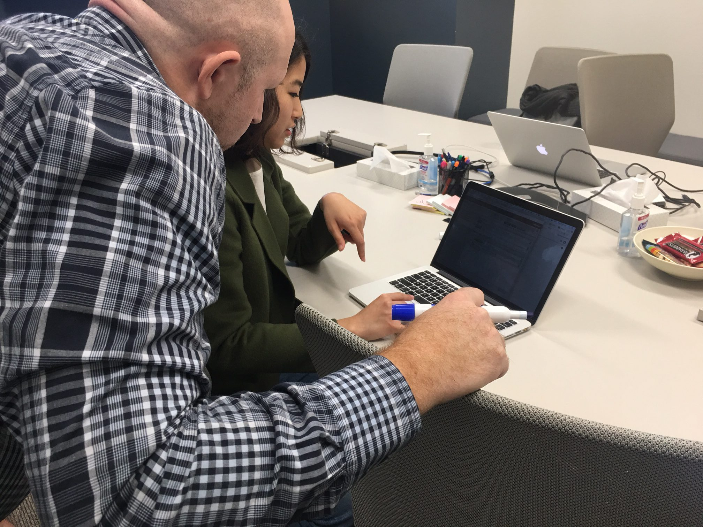
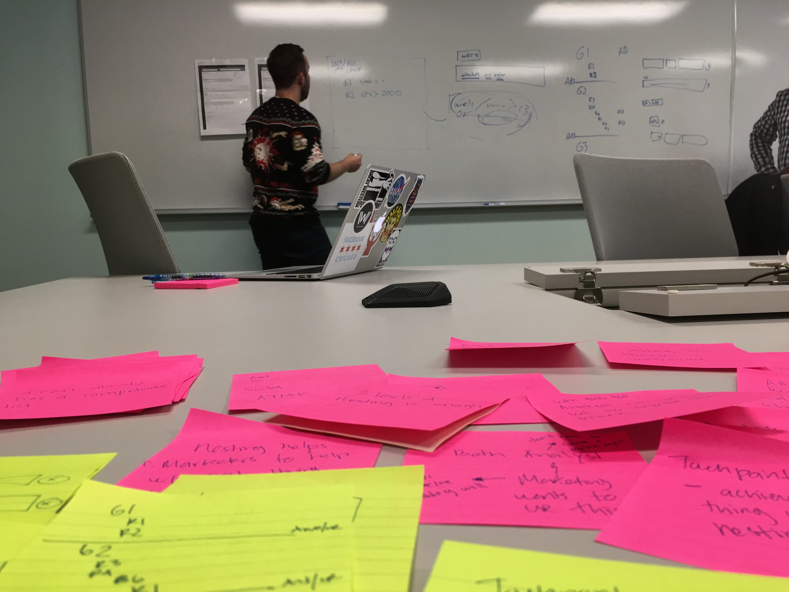
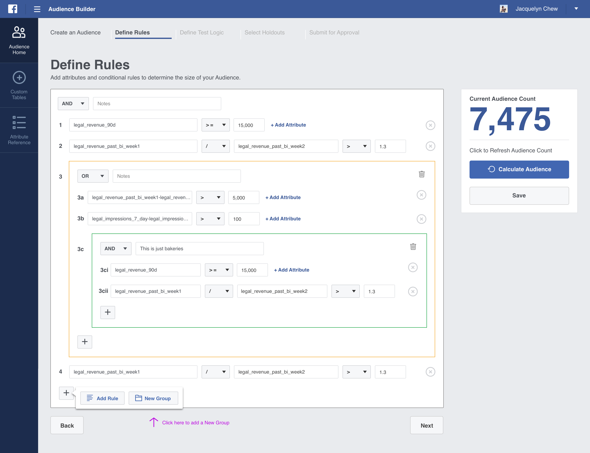
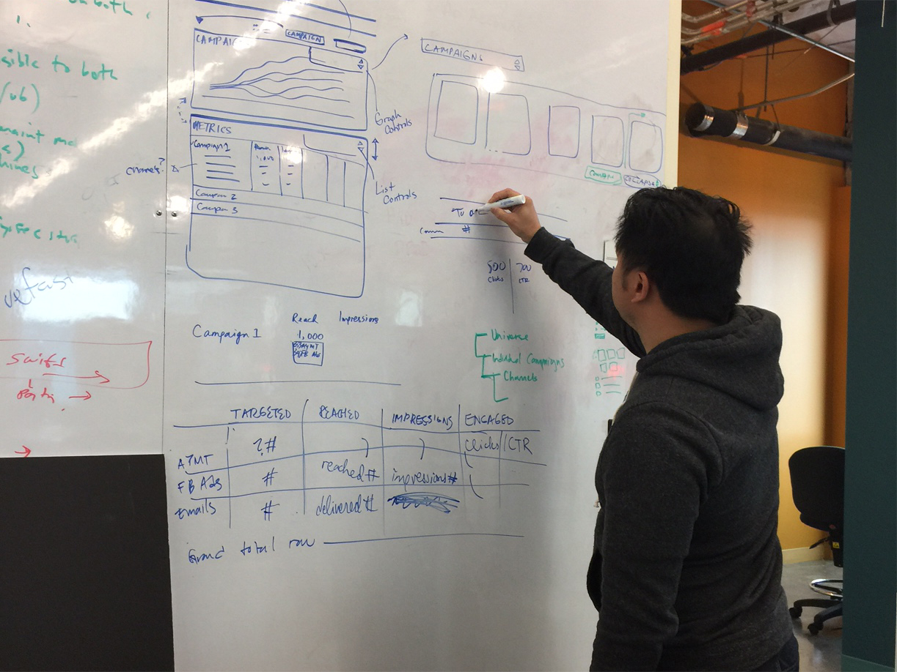

Facebook’s growing SMB Marketing business unit was built with a grass roots approach and used processes created for small and nimble teams. As business needs expanded, they found it more difficult to maintain their original processes while effectively managing the increase in campaign volume. They desperately needed a scalable, unified platform with a modern user experience designed to tackle the increased demand while successfully growing their organization.

We partnered with Facebook’s team and took a people-first, human-centric approach to building their new platform. In doing so, we identified over a dozen different processes split across tools required to launch ad campaigns. Our approach harmonized these experiences into one unified platform with role-based activities. In the final sprint of the engagement, we built an enhanced dashboard experience with a global view of campaign details and a data-rich front-end.

#### MODULE 1 DISCOVERY
Empathy is key to uncovering user needs and challenges. Quickly identifying the stakeholders and users allowed us to research, learn, and uncover arduous processes required to create and manage campaigns. Our contextual one-on-one interviews and group validation sessions laid the foundation for the discovery phase.

#### CURRENT TOOLS
In addition to understanding users and their processes, it was important for us to audit the existing toolset t0 learn the individual features and find opportunities for efficiency and simplification.

#### ESTABLISHING A DIRECTION
Collaborating directly with users resulted in quicker alignment to goals, objectives and overall product strategy. Impromptu whiteboarding sessions, iterative concept sketching and low fidelity wireframe prototyping produced quick results for establishing a design direction.

#### DELIVERING MODULE 1
End-user feedback and iterative design processes provide valuable feedback when creating clickable prototypes with robust, engineering ready experiences.

#### MODULE 2 DISCOVERY
The design process went back to the drawing board with more sessions for discovering how to solve the problems.

#### WIREFRAME ITERATION
The XD team presented wireframes of the main dashboard to garner feedback.

#### DELIVERING MODULE 2
By creating new wireframes in Invision, the XD team created a clickable prototype that allowed the marketing team to dive into the main user flows as well as the micro-interactions they helped cultivate.

