<table>

<tr>

<td></td>
<td>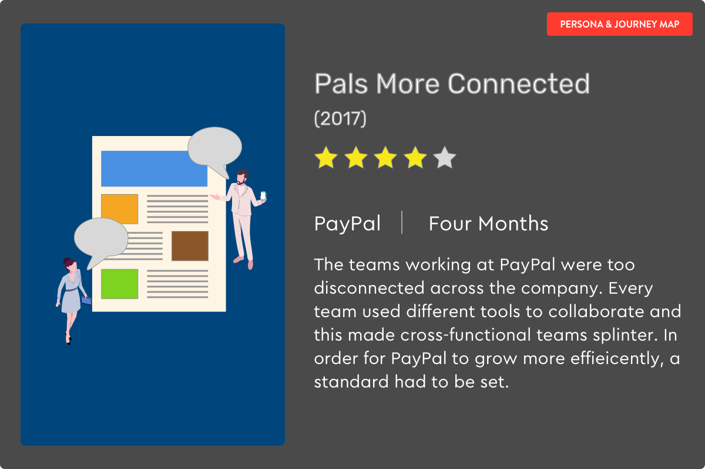</td>
<td></td>

</tr>

</table>

<table class="post-navigation">

<tr>

<td><i class="fab fa-readme"></i> &nbsp;Read the story below</td>
<td><i class="fas fa-angle-double-down"></i> &nbsp;<a href="#spoilers" target="_self">Jump to spoilers</a> </td>

</tr>

</table>

&nbsp;

Even though PayPal has grown a lot over the years, it has always maintained a very agile culture. This has given different teams the freedom to have different workflows that suits their needs. Although its great at the team level, it means that there is not standard process for collaborating across the company. The OCIO has a need to streamline these tools and processes as a means to make the company leaner and more cost efficient.

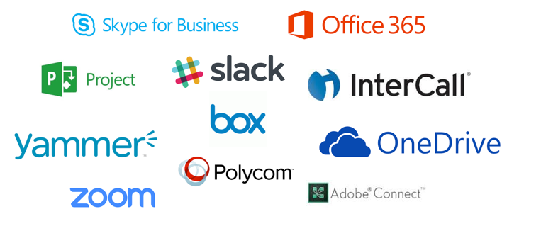

#### HOW WE HELPED
Slalom came in to present the voice of the users to the OCIO. This was done as a joint effort between the Experience Design and Operation Effectiveness teams. The OCIO had previously focused internal efforts on just the tools that users implemented but Slalom’s focus was to help them think more broadly, the people who use those tools. This was done via in-depth interviews across various user profiles. This resulted in personas, journey maps, and an adoption strategy that the OCIO could use to plan for more successful internal initiatives going forward.

#### CONDUCTING INTERVIEWS
In order to better help the OCIO talk to their users, we had to get to know them better. Through the internal team collaboration, we revised an interview script of 22 questions that would lead us into getting to know the PayPal process flow better.

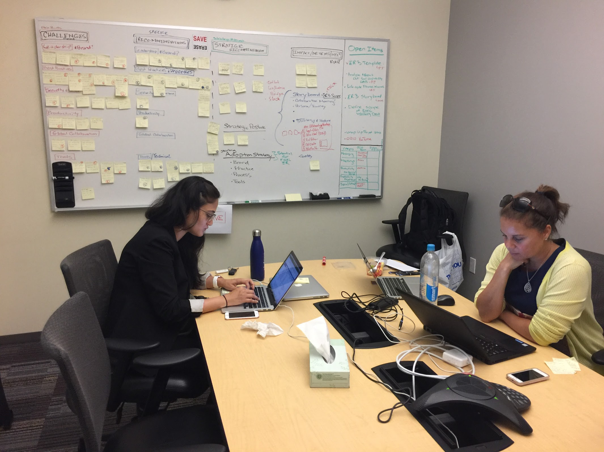
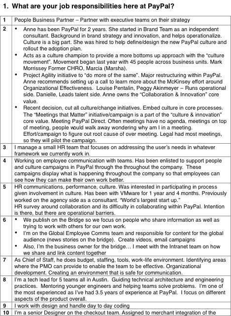

#### ANALYZING RESULTS
With over 22 interviewees providing answers to all of our questions, there was a ton of data to mine through. As a team, this involved whiteboard sessions to go through and pull out the findings.

#### CREATING PERSONAS
Finding the patterns out of the interviewees took some brainstorming and discussion but in the end, we were able to find 5 unique personas that covered everyone to some degree. It also involved representing raw data that we identified from the analysis in meaningful ways.

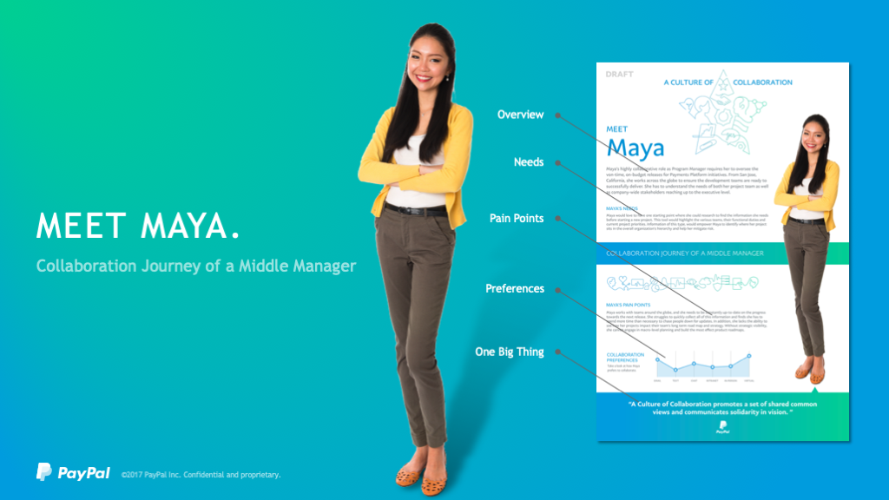

#### Here they all are together!

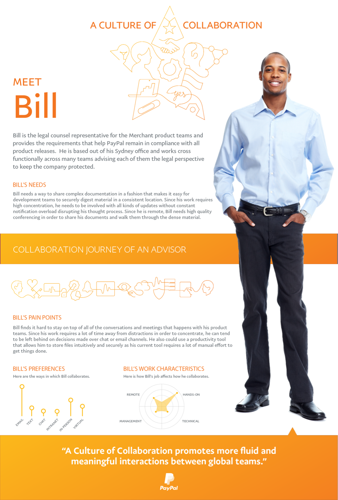
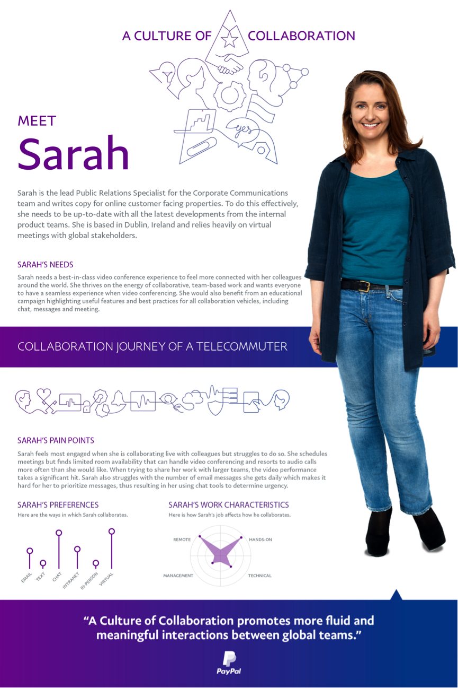
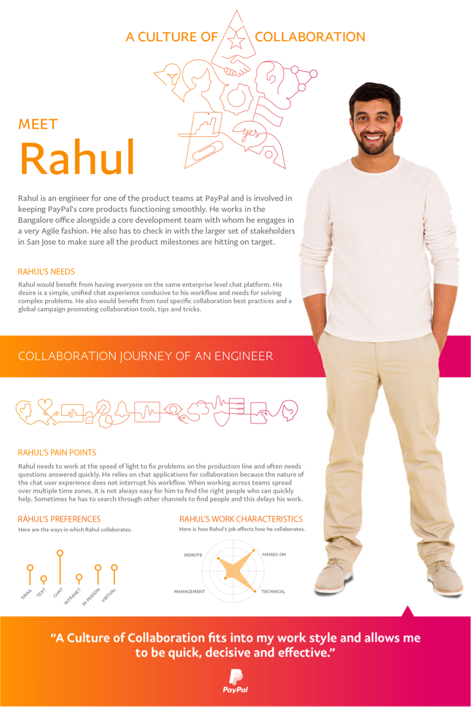
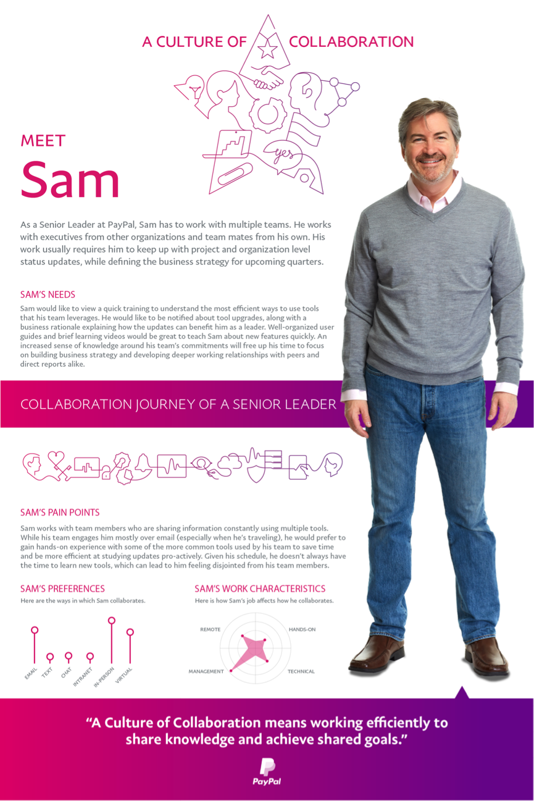
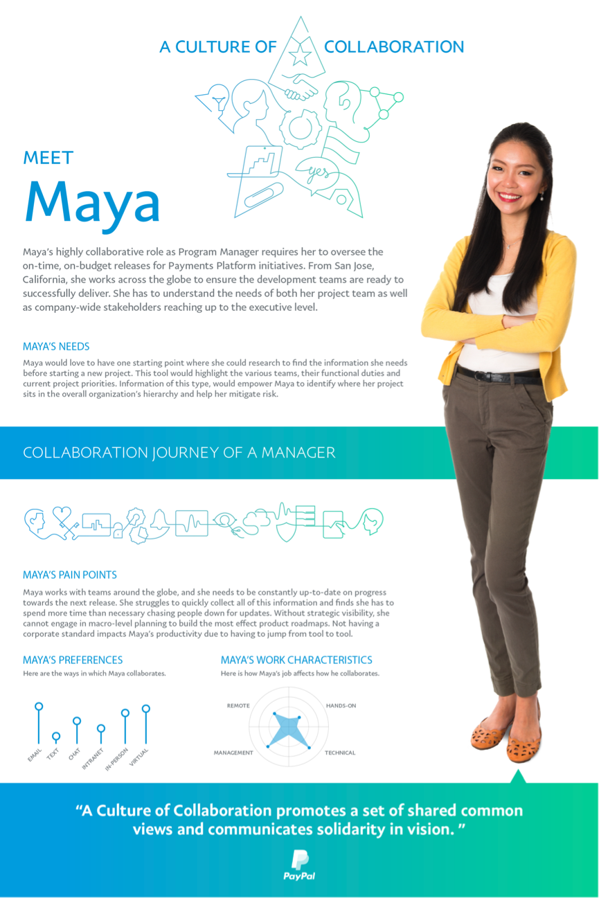

#### MAPPING JOURNEYS
The next step involved identifying the various phases of the journey for each of the personas. With the personas and the data in hand, we started to identify phases of collaboration. This resulted in us needing to validate the findings with the interviewees through follow up sessions.

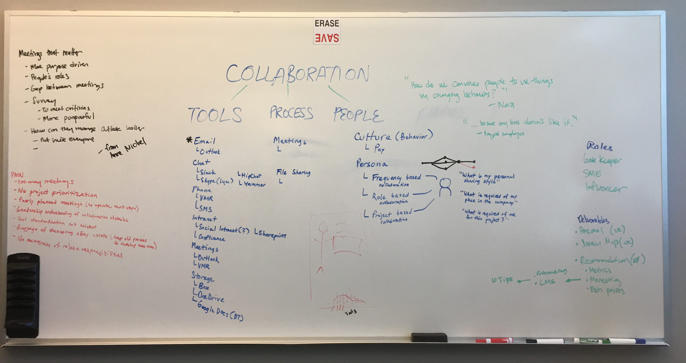

#### DELIVERING JOURNEYS
Translating the ideas into a formal Journey Map took many iterations and reviews but resulted in representing all 5 Personas together to give some context of collaboration at PayPal. This led directly into the OE team’s Adoption Strategy that kicked off the last phase of the project.

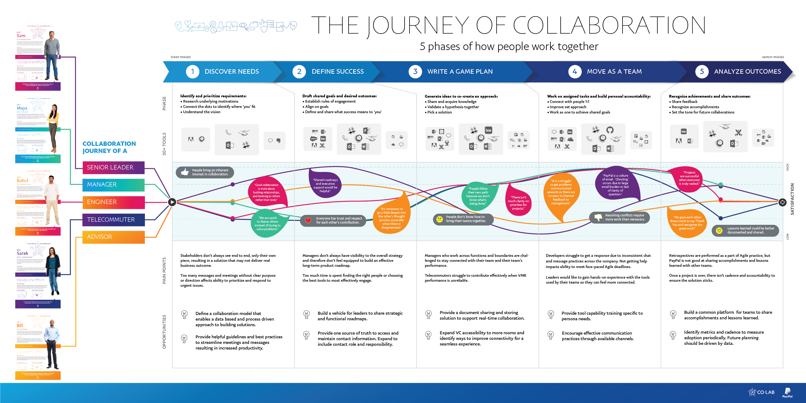

#### BRAND IDENTITY
In order to sell the overall vision of how the personas and journey map could be implemented, it was beneficial to show it could culminate in a sample of a branding campaign. The team put together branding materials that would mimic an actual campaign, complete with a name, logo, and marketing materials in the form of posters, web sites, email newsletters, and banners.

This is just a small sample of all the branding materials. Check out the full page to view more samples.

As part of the final Adoption Strategy for the PayPal OCIO project, an exercise was performed to help convince the stakeholders of the power of a brand. The Slalom team came up with a brand name called CO.LAB, which was a play based around the word collaboration and would lend future branding exercises some creative freedom. In addition to the name itself, the Slalom team put together some concepts of how this brand would be propagated across print, web, and mobile platforms. This helps sell the effectiveness of such efforts and encourages PayPal to actually plan for such projects in the future.

<h2>Was it helpful?</h2> Our team presented the voice of the users to the office of the CIO. The new focus to be more people minded and how that can be done was a revelation. They launched a multi-year initiative to roll this worldwide and is in effect to this day.

<a id="spoilers">Spoilers</a>

