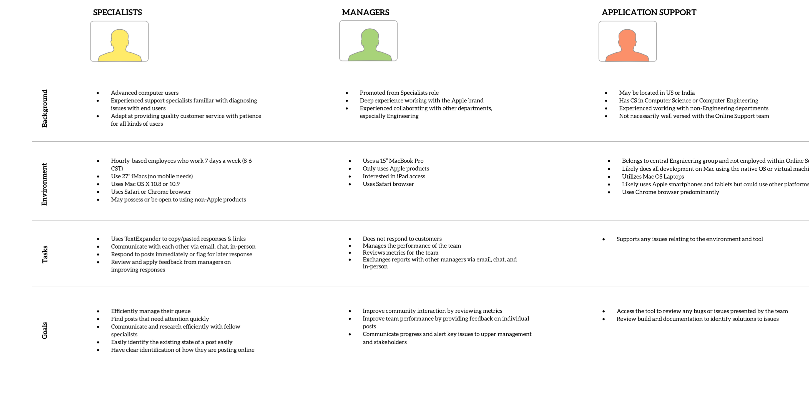
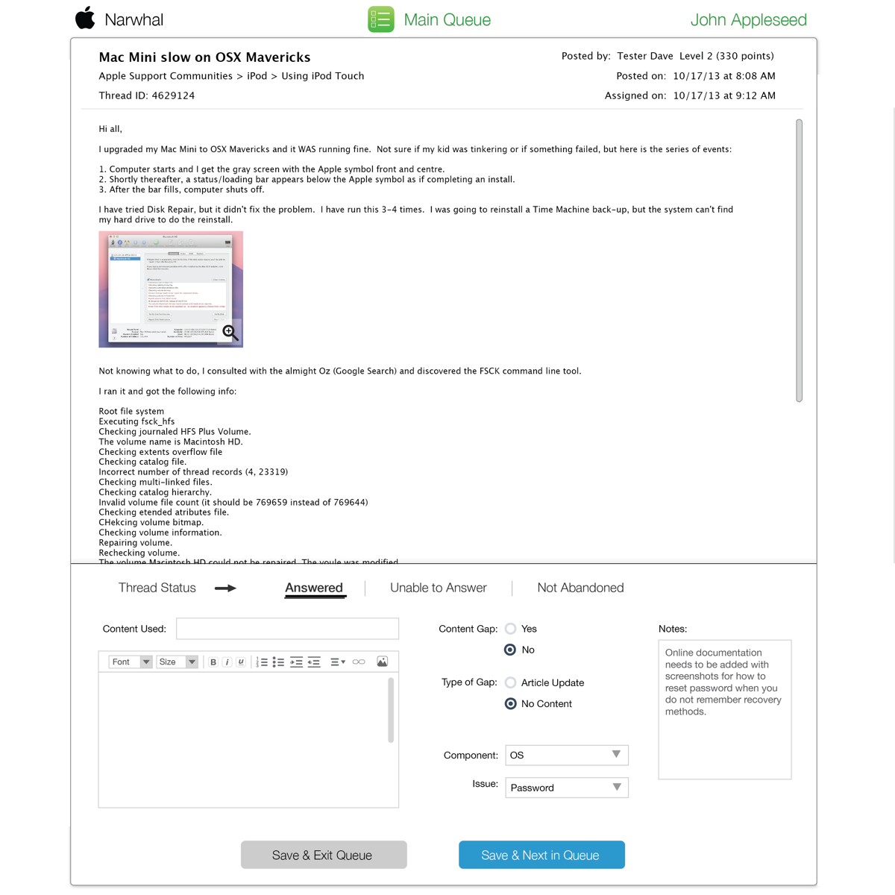

As the lead designer, I worked with the Apple Customer Support team to take them into a whole new level of efficiency by automating their daily routines.

#### Empathy is always the starting point

Apple’s explosive growth after the iPhone’s initial launch, quarter after quarter, is now the story of business legend. Yet, not every department with the company scaled at that same pace. One such department is the Online Support team who did could not scale as fast but had to provide support to the millions of new users who were coming on every quarter. I joined this team to help them find ways to automate their current offline processes so that they could scale their efforts to meet the demands of more users.

#### Stepping into Product Management

I found out that the assigned Product Manager had already crafted requirements. I wanted to review this documentation so that I could include a design perspective that would add more value about how the user interface should be presented.

#### Profiling Users

The product would involve internal users whom were clearly identified to me so I decided personas were not necessary. I still made user profiles based on the two key types of roles that would be heavy in the app.

#### What a Typical Workday like?

Of course its important to understand the plight of users in their full context so I interviewed the actual support specialists to get an idea of their typical day. I sketched this out so I can get a feel from a macro perspective.

#### Taking a Bird's eye view Of it all

Building off all the tasks that happen in a typical day, I iterated upon creating task flows. This required constant feedback from the Support managers to get the right steps of the process down.

#### Now it's time to Get closer

As I have that macro picture working in my head, I start to investigate how some of the key screens would play out. On these key screens, I sketched the flow of interactions that would happen within each screen. A well done design makes sure these individual microinteractions add up to be consistent with the macro user flow identified earlier.

#### Building out Screens

I pulled out Omnigraffle to do actual wireframes of all the key screens from the user flows. It was also important for me to iterate on these with all of the stakeholders so that I didn’t veer too far off track.

Outside of the issue of data visualization graphs, the rest of the wireframe flow received very positive reaction. 

I offered to take on the visual design tasks and crafted the migration of the work into the Adobe Creative Suite. I adhered to the Apple style guide as much as possible but had my own chances to veer off it slightly since this was an internal app. In addition to coming up with the visual design, I created an app icon as representation of each section to give the simple UI some pops of flair.

#### Handing off to Developers

During the documentation phase when I worked with developers, it was found out that the PX notation I was using throughout was causing issues during development. Working with over 100 screens, I consulted with them and found that EM would be a more reliable method of translating designs to development and thus I updated all notes to reflect this, calculating each unique element and screen as necessary.

#### Turning Japanese

As development began, there was the need to do some localization and the first such language to be addressed was going to be Japanese. I updated a few assets in Japanese and passed them along to development.

#### New User Profile Added

A final gesture from me was to provide a sampling of the iPad app that managers could use. Alas, I had to leave the project before this could be built.