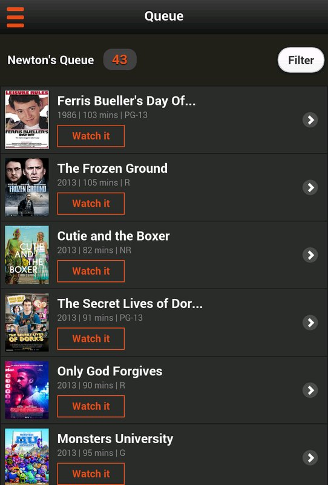

<table>

<tr>

<td></td>
<td></td>
<td></td>

</tr>

</table>

<table class="post-navigation">

<tr>

<td><i class="fab fa-readme"></i> &nbsp;Read the story below</td>
<td><i class="fas fa-angle-double-down"></i> &nbsp;<a href="#spoilers" target="_self">Jump to spoilers</a> </td>

</tr>

</table>

### Prologue
Content is exploding and some people will say we are in a story rennaisance. There are more streaming platforms for all kinds of media, whether your poison is books, movies, music, or games. And there are more and more being added on a daily basis!

### Conflict
Today’s entertainment world is scattered in so many directions that it can be challenging for anyone to keep up with the
content that matters to them. It doesn't help that we also have that ever so hypnotic second screen at the ready to distract with work and social.

### Main Character
As a side project while working at Walmart.com, I took a real world user experience that I felt was lacking in the marketplace and presented it as a design solution for Vudu.

&nbsp;

<table class="post-navigation">
<tr>
<td class="half">
	<h6>Cast (Team)</h6>
	<ul class="project-details">
		<li>Product Designer (me)</li>
	</ul>
</td>
<td class="half">
	<h6>Specifications</h6>
	<ul class="project-details">
		<li>Sketch</li>
		<li>Invision</li>
        <li>Competitive Analysis</li>
	    <li>Mobile Design</li>
        <li>Paper Sketching</li>
	</ul>
</td>
</tr>
</table>

### Story

This was a problem that I had for myself as I tried to raise a family, maintain a career with emails coming 24/7, and take
graduate courses. I grew up in love with my stories as it added cultural relevance and entertainment to my
life. On top of this, I would have conversations with others and we would get into talking about movies and
TV shows and books and music and it always left me with the desire to catch up intriguing content. It’s not
like the old days where everyone consumed content in the same place through their local broadcast network
or radio station or library.

Life in general is too splintered and there has to be a more interesting way to manage this stuff. Yes, its not critical
to one’s life but when you include the arts, doesn’t it make life more fulfilling?

I consider this a unique problem but went into various app stores to find tools online or on mobile platforms. I largely
came up empty as what I basically found was similar to something like GoWatchIt. I did sign up for a couple
of them but each was a glorified queue and they simply didn’t have integration with as many products as I
would like.

Most queue products don’t actually take into account the various situations in which I could consume media and treats it
all the same. In addition, I did not find anything that could incorporate additional media types such as
books and music.

Is there a reason that there isn’t a service that bundles all kinds of media together? I did a search to see if services
across platforms provided APIs and for the most part everything I looked up did provide the relevant data
feeds.

There might be some technical concerns about what data would get pulled from these APIs but I didn’t focus too much on that
for this initial prototype. As long as some data could be pulled, there should be enough to incorporate it
into the design.

So there can be a logical means to build a queue around multiple media types. That’s great and could be a valuable add into
the marketplace but it’s not really enough. I mean, how is this different from just keeping a Google Sheet
with links? The design problem here needed to be solved with a more advanced solution. Thus I wanted to take
into account key factors that limit someone’s ability to make a choice about how to consume media.

I thought through this interactive experience. With the onset of conversational UIs spreading the marketplace, I figured
this would be a great way to make finding media less burdensome. I took some of the variables that could
impact the what to consume and when and presented a branching diagram to make sure I covered all my bases.
I was just focusing on this portion of my product as it was the most abstract and queue management can be
leveraged on best practices that already existed.

Using my own family as users for this project, I mapped out user flows that would potentially take place. Sketching this
by hand gives me immediate feedback and a sense of being actively engaged in my work.

I needed to take this concept to a traditional wireframe to see if it all worked together. I shared this with a couple of
friends to get the feeling of whether it worked or not and got positive feedback, which inspired me to create
the mockups.

I ventured into taking the initial wireframe concepts and created visual mockups in Sketch, starting first with the onboarding
experience. My expectation was that these screens would serve as a book cover before getting into the app
so it would be overall a darker and bolder visual design.

I crafted a default list for an active user and put together key elements that I felt would be of most importance. There
obviously had to be references to the order and metadata about the medium itself. In addition, the key element
of time was included as well as indicators showing if the item was instantly accessible or not.

Empty screens are usually areas for designers to skimp on but is something I always want to consider. I created a few screens
with flow directions below of a user who has nothing in their queue and wants to search to add something.

Empty screens are usually areas for designers to skimp on but is something I always want to consider. I created a few screens
with flow directions below of a user who has nothing in their queue and wants to search to add something.

Finally the most unique aspect of this application is the conversation flow I wireframed earlier. Sadly as I was wireframing
all of this, I realized the actual steps for interaction adds unnecessary burden on the user to interact.
So I used the conversation form factor but provided all of the choices the user makes in cards subsequent
to the questions above. I think this is more easily interactive and efficient overall for this particular
use case.

The new alerts experience was introduced with some of the features of Investigations without making users learn a new experience. Giving users better insight was a key focus on features that were prioritized into this earlier release.

### Epilogue
Now that I have a concept in place, I'd love to actually use the project to practice building a mobile application. In the meantime, I will also test with more users to see if the concept has traction. Who knows, it may even end up hitting the app store one day.

<h3 id="spoilers">Spoilers</h3>

