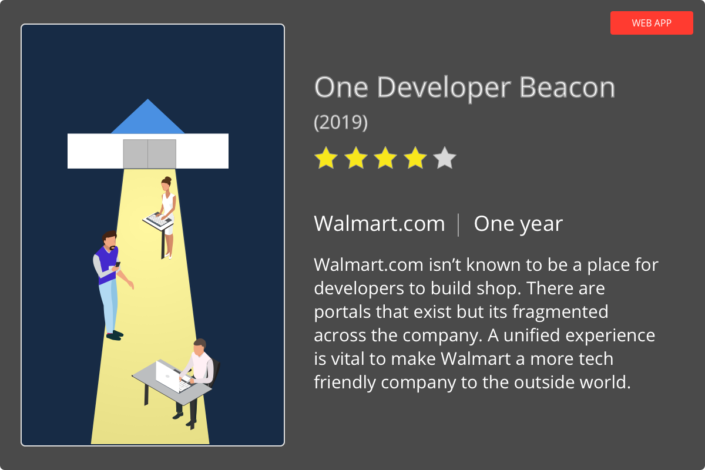

The Walmart Affiliates posed to me a query on establishing a new experience for its core users. They wanted to build a new product for their users but also wanted to create a scalable platform in house. Walmart.com approached my Slalom team as they had an ongoing partnership with our company. The project started with nothing but ideas from there.

Working with my client team, I addressed concerns about building a new platform since it was new to this particular team at Walmart. I felt it was good experience to onboard and educate them on the design process as we did some brainstorming and competitive analysis. I had to explain how this project didn't require just design but an entire ownership on all process and so that was how it all kicked off. 

I recruited a team to begin the entire effort but since budgets were limited, I had initially the option to only add 1 more Slalom resource. I recruited a writer who had deep experience in technical documentation. Although I think of myself as a good writer, I couldn't make sense of how best to write API specifications that would sing for users. The Walmart Affiliates team had an existing platform that was going to sunset so we reviewed support emails from users and interviewed internal teams about what was working and what was not.

I presented a summary of my findings to the VP for Affiliates and he was pleased that I was herding cats. Together with the tech writer, we learned more about the API documentation that Affiliates utilized and what other users might end up overlapping with this product. This was a minefield of discovery with every step forcing a new bomb to my consciousness of the product and I documented our findings on their internal Confluence. 

Working with an entirely technical audience, nobody asked for personas or user profiles. I thought it was important to use them to set a level set to show what users would be using this platform. This would help engineers empathize with the users when discussing the product requirements. Walmart Affiliates had only been thinking about their external users but during our discovery, it was obvious that internal users were just as critical. How can a documentation site stay fresh if the internal producers dont like using it?

At this point I was more concerned about how to implement than what to implement. Walmart wasn’t the easiest place to get things done with a lack of process between groups and no documentation on how to do anything. I discovered an internal team that worked with Jekyll to make deployments to the Walmart audience. It didn't require engineering a new platform so we can have it as a starting point for a V1 experience.

[Insert graphic about Strati deployment]

<table>
<tr>

<td class="half">

</td>
<td>
<h4>ITERATIONS UPON A DESIGN</h4>

We pushed an initial build out on a Jekyll platform with the help of my technical writer who luckily had some basic chops to tinker on configuration code. I created a marketing one page template and reviewed this with the team internally. This was for a soft beta launch as we were taking the existing Affiliates site and moving it over to the new experience. It was important to push something out there sooner than later to get it on management radar at Walmart otherwise our work would have gotten lost in the shuffle.

</td>

</tr>
</table>

But we had to start integrating more advanced features such as a Login experience. I did my research to scope this out and utilized user flow diagrams to understand the process that would need to be captured. I had to do this 7 times because I would present to individual teams separately and have to edit the diagram based on feedback. This diagram culminates in a consensus among teams that would never talk to each other.

<table>
<tr>

<td>
<h4>LEVERAGE WHAT WORKS</h4>

To implement this login feature, I pushed for leveraging the Walmart.com account experience that exists for consumers. Walmart.com's universal login did not serve any other internal services other than the eCommerce site. This wasn't like Google or Facebook or Apple that had a shared enterprise and consumer experience. I received push back for this at Walmart and consulted with my team at Slalom for validation, which they gave me.

</td>
<td class="third">

</td>

</tr>
</table>

#### OOPS

After pushing so hard on this feature, I started to realize that Jekyll was a simple static generator and could not handle making dynamic calls to a backend service and have it smoothly integrated into the UI. Jekyll was not the right choice and we consulted with engineering teams and found that React was used internally and would be more scalabe for other features. I was excited I got a reason to play with React but realized that we would have to redo the entire site in a new build system... one much more complex than before.

#### THE GREAT REBUILDING

When rebuilding the site in React, we also did some rebranding of the Jekyll site that was pushed to production. I had complete ownership on the process and I wanted to leverage more Walmart.com patterns as I felt that it would be better for the brand as a whole.

I also wanted to introduce some proper icons into the site to flesh out sections and give users markers on what section they are in.

Utilizing some updated colors and fonts that were published to Walmart.com, I coordinated with the Director of Design to continue to sync up my design with theirs.

#### SOFT LAUNCH

After rolling out the new feature set, we saw a major spike of traffic organically visiting the site. We put in a survey form on the site to collect feedback and as users were asking support questions, I would return ask to get some input about the features that we could add.

#### NEW FEATURES

Next phase of the project meant to incorporate additional new features that would be cutting edge for the site. This includes a search engine, sandbox, and content management tools. These features were identified from the discussions I had with internal teams, external users, and competitive analysis. It was a generous mixture of all 3 of these sources to identify a roadmap for future quarters. I made each of these in mockups and interactive prototypes and fleshed them out by reviewing with stakeholders.

[Search, Sandbox, Innersource]

#### HARD LAUNCH

We had to migrate the 60,000 enterprise users to the new platform and I crafted materials to onboard the users onto the new platform. 

[Graphic of marketing materials]

> <h2>Was it helpful?</h2> Walmart hired a brand new enterprise team thanks to my initiative. Due to my involvement in this project, I was able to get my client partner promoted by taking ownership on the developer experience and bringing it in house. Traffic to the site spiked 30% quarter over quarter and received a commitment from the rest of the Walmart leadership that this is a platform that will have legs for many years to come.