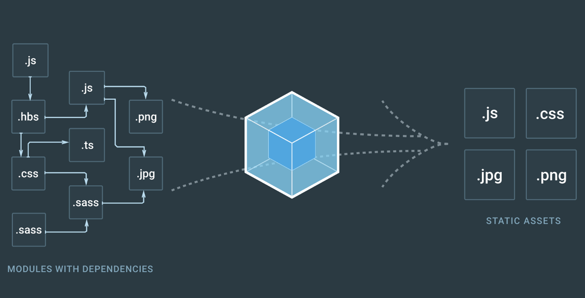

Walmart Affiliates posed to me a query on establishing a new experience for its core users. They wanted to establish a new product for their users but how is it best to create an enterprise play within a consumer giant? As an external consultant, I had to find the best path forward.

I sat alone with my client team concerned about where I should start as nobody had any experience in such matters. I felt it was good to onboard and educate them to the design process. This team would need a lot of team members to implement this but had only the budget for me so far.

[Graphic of multiple roles coming together: Product Manager, UX Designer, Front End Programmer, Content Writer, Marketing Manager]

I began this effort with a deep dive of the competition to help me strategize on priorities. We can’t plan for a team and a roadmap without identifying what it is we build. I collected user feedback from past emails that were sent in and interviewed teams internally.

#### TITLE

I didn’t feel it was enough to just spit out my user requirements to the client by bullet point as it kills attention spans. I enlisted the help of a technical writer from my personal contacts who understood technical documentation and help me forge my bullets into a personality.

[Graphic of Walmart I/O initial concept and a PowerPoint slide showing priorities]

#### TITLE

I presented this and the client was pleased that I was herding cats and I can tell he was more confidence in my approach. So I pushed onward to learn about Walmart API implementation in general. This was a minefield of discovery with every step forcing a new bomb to my consciousness.

<table>
<tr>

<td class="half">

At this point I was more concerned about how to implement than what to implement. Walmart wasn’t the easiest place to get things done with a lack of process between groups and no documentation on how to do anything. But I forged on making relationships and understanding people both internally and externally and what I wanted to get done.
</td>
<td>

</td>

</tr>
</table>

#### PRACTICE MAKES PERFECT

We pushed an initial build out on a Jekyll platform with the help of my technical writer. This was an early stage beta release and didn’t need a ton of integration since it was self sufficient (for now). I got some help when it came to hosting the site internally to Walmart but had to really push myself to get basic pages up.

But we had to start integrating more advanced features such as the Login experience. I did my research to scope this out and utilized wireflow diagrams to understand the process. I had to do this 7 times to get to a proper consensus where each iteration required a presentation in front of multiple teams. I revisited and revisited until I had closure from everyone. It took weeks to close this out.

#### TITLE

We had to now share this new experience up to the different teams that we partnered with up to this point. It was time to take the experience to the product up to a V2 at this point. The first thing users would need is a login experience and so I pushed for leveraging the Walmart.com user account.

#### TITLE

Adding in new features to make the login relevant was necessary next. We reviewed the interaction design and what was needed to pull it all off. I couldn’t do it alone and got management to add in a front-end developer.

<table>
<tr>

<td class="third">

</td>
<td>
I had to defend my case for the login to every team I collaborated with and it made me question my decision. I vetted the idea back to the rest of my design crew at Slalom and I got universal approval that I was going the right way so I stuck to my guns.
</td>

</tr>
</table>

#### OOPS

After pushing so hard on this feature, I started to realize that Jekyll was a simple static generator and could not handle making dynamic calls to a backend service and have it smoothly integrate into the UI. Jekyll was not the right choice and we consulted with engineering teams and found that React was used internally. I was excited I got a reason to play with React but realized that we would have to redo the entire site in a new build system... one much more complex than before.

#### DEFENDING THE ASK

In parallel, I shared the new affiliates experience with partners who would be on boarded onto the platform as initial testers. They gave constructive feedback that I wanted to apply but the feedback was positive. Because of this, I got funding for the team to add a new backend engineer to deliver on more features.

#### SOFT LAUNCH

After rolling this feature out, we saw a major spike of traffic onto the site. I collected feedback from users to get a better understanding of what was working and what was not.

[Graphic of analytics]

#### HARD LAUNCH

Now that there is a place of a complete product, it is time to do a proper marketing push and that is where the story ends. As Walmart dawns this new product to the world with expectation of thousands of new users, I feel confident it will continue to meet the demands of it users.

[Graphic of marketing materials]

> <h2>Was it helpful?</h2> Walmart started a brand new enterprise focus thanks to my initiative. Due to my involvement in this project, I was able to get my client partner promoted and introduce a bold new concept of taking ownership on the developer experience and bringing it in house. Traffic to the site also spiked up over 30% with only organic search optimization.