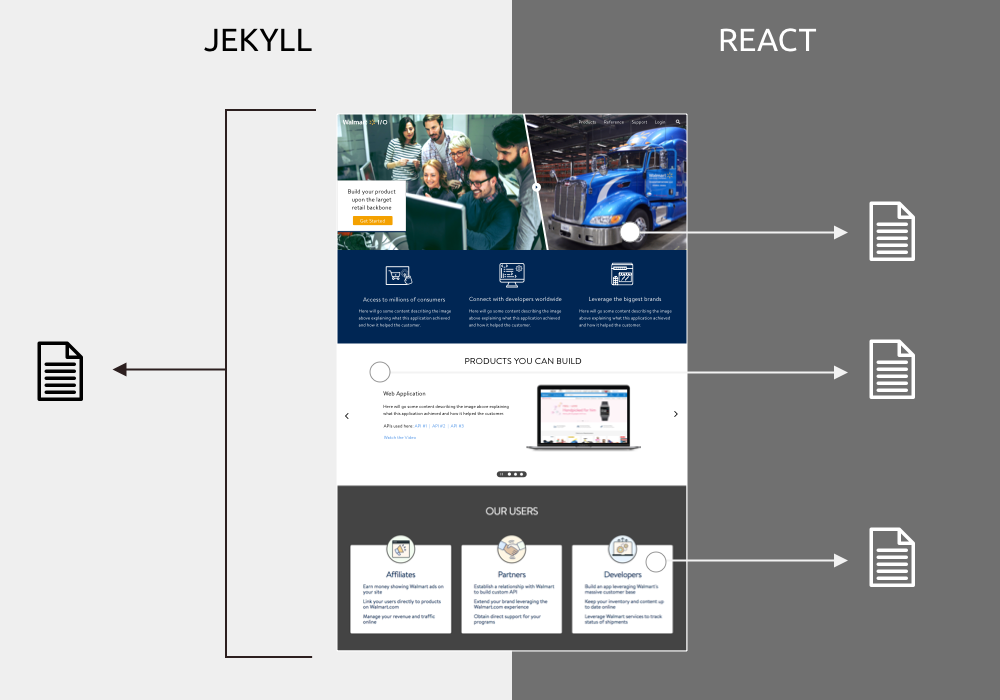

<table>

<tr>

<td></td>
<td></td>
<td></td>

</tr>

</table>

<table class="post-navigation">

<tr>

<td><i class="fab fa-readme"></i> &nbsp;Read the story below</td>
<td><i class="fas fa-angle-double-down"></i> &nbsp;<a href="#spoilers" target="_self">Jump to spoilers</a> </td>

</tr>

</table>

&nbsp;

### Prologue

Walmart.com's Affiliate Team manages APIs that developers could use to build out their own products. This is similar to the likes of many other large tech companies, such as Google, Amazon, and Facebook, that leverage the developer community to extend ttheir product platform.

### Conflict

Walmart.com was using a third party service to host these APIs for their different programs but realized this would not be a proper platform if they had ambitions of building out a formal developer platform their competition. If the world's largest retailer wanted to court developers to it's e-commerce platform, they had to step up their game to make it a robust place to come and do business.

### Main Character

Via Slalom Consulting, I was introduced to the Walmart.com team and it was a natural fit for me to step in and manage the whole initiative. The VP of the division posed to me a query when I met with them for an initial consultation: how do we get a developer portal up and running that will be world class? I addressed concerns about how vague the project sounded and wanted to teach Walmart all the skillsets required to build a new application of this scope. With only budget for two resources, they agreed to have me come on board to own the project from scratch and figure it out as I went along.

&nbsp;

<table class="post-navigation">
<tr>
<td class="half">
	<h6>Cast (Team)</h6>
	<ul class="project-details">
		<li>Product Design Manager (me)</li>
		<li>UX Writer</li>
		<li>Front-end Developer</li>
		<li>Full Stack Engineer</li>
		<li>VP of Tools & Services</li>
		<li>Director, Tools & Services</li>
	</ul>
</td>
<td class="half">
	<h6>Specifications</h6>
	<ul class="project-details">
		<li>Sketch</li>
		<li>React</li>
		<li>Storybook</li>
		<li>Responsive Design</li>
        <li>HTML/CSS</li>
        <li>Analytics</li>
	</ul>
</td>
</tr>
</table>

### Survey the landscape

It was up to me on how to utilize resources available to me. I started by recruting a technical writer who had deep experience in writing technical documentation. Although I think of myself as a good writer, I cannot for the life of me understand the technicalities of API specifications. Together we did competitive analysis and identified the features utilized on other platforms that kept everything tied together.

In addition to an external audit, I performed one internally since I need to know as much about stakeholders and tools as I can to make informed decisions. Do I forge down a path that has already been done and failed? What's the point? I presented a summary of my findings to the VP for Affiliates and he was pleased that I was herding cats. 

[INSERT PIC OF THEMES OR FEATURES OR TOOLS]

### Theme for Implementation

In order for a new documentation platform to be beneficial to developers, it had to be a frictionless experience that allows developers to jump in and get started as quickly as possible. This was as true for the external developers who would digest the information as it was for the internal developers who wrote it.

Since I presenting my work to an entirely technical audience at Walmart, nobody was going to ask for personas or user profiles. I thought it was important to create a shared understanding across the set of stakeholders and help them empathize with the needs of external developers. My stakeholders only had external users on their mind when I started but we discovered during this process that internal users would be far more important to make this product successful.

Walmart wasn’t the easiest place to get things done with a lack of process between groups and no documentation on how to do anything and moving every step in the lifecycle requires discovery and negotiation. I identified an operations team who hosted sites internally so we both performed some quick design and content work and pushed out some initial pages in static HTML like as if it was 1995. It wasn't meant to be excellent but was meant to get stakeholders engaged in the process as we continue to move forward.

[ADD NOTES TO THIS PIC]

But we had to start integrating more advanced features such as a Login experience. I did my research to scope this out and utilized user flow diagrams to understand the process that would need to be captured. I had to do this 7 times because I would present to individual teams separately and have to edit the diagram based on feedback. This diagram culminates in a consensus among teams that would never talk to each other.

To implement this login feature, I pushed for leveraging the Walmart.com account experience that exists for consumers. Walmart.com's universal login did not serve any other internal services other than the eCommerce site. This wasn't like Google or Facebook or Apple that had a shared enterprise and consumer experience. I received pushed for this in light of everyone at Walmart wanting to simply create a new login experience instead. I went back to the theme of getting developers onboarded quickly and since many of the developers working or planning to work on the platform had Walmart.com consumer accounts, I used this as arsenal to build this into the conversation internally.

After pushing so hard on this feature, I started to realize that Jekyll was a simple static generator and could not handle making dynamic calls to a backend service. I led the conversation with different engineering teams and found React was starting to get used internally at Walmart and I could potentially leverage the framework. I had built good momentum with my stakeholders and convinced them to help me add more resources to the team. I was able to get consensus to bring on a front-end engineer and a back-end engineer to form out the team that I would manage. I then went to planning the overall migration efforts as it sadly dawned on me that we would have this site all over again.

When rebuilding the site in React, we also did some rebranding of the Jekyll site that was pushed to production. I wanted to leverage more Walmart.com patterns as I felt that it would be better for the brand as a whole. Nobody asked me to integrate the two but I felt that a proper brand extension made the experience stronger. In addition, we revisited the content architecture to make sure we presented different products in the ways in which develoeprs can find it the fastest.

I introduced my own iconography, utilizing colors for different sets of documentation. This wasn't 100% on brand with Walmart but it would help developers quickly identify content based on the theme of the icon.

I maintained close connections with the consumer design team and they ahd a UI refresh while we were rebranding so I had consistent conversations to make sure we synchronized where possible.

After rolling out the new feature set, we saw a major spike of traffic organically visiting the site. We put in a survey form on the site to collect feedback and as users were asking support questions, I would return ask to get some input about the features that we could add.

Next phase of the project meant to incorporate additional new features that would be cutting edge for the site. This includes a search engine, sandbox, and content management tools. These features were identified from the discussions I had with internal teams, external users, and competitive analysis. It was a generous mixture of all 3 of these sources to identify a roadmap for future quarters. I made each of these in mockups and interactive prototypes and fleshed them out by reviewing with stakeholders.

We had to migrate the 60,000 enterprise users to the new platform and I crafted materials to onboard the users onto the new platform. 

### Epilogue
Walmart hired a brand new enterprise team thanks to my initiative. Due to my involvement in this project, I was able to get my client partner promoted by taking ownership on the developer experience and bringing it in house. Traffic to the site spiked 30% quarter over quarter and received a commitment from the rest of the Walmart leadership that this is a platform that will have legs for many years to come.

<h3 id="spoilers">Spoilers</h3>

