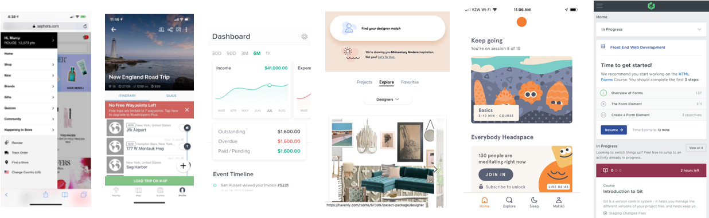
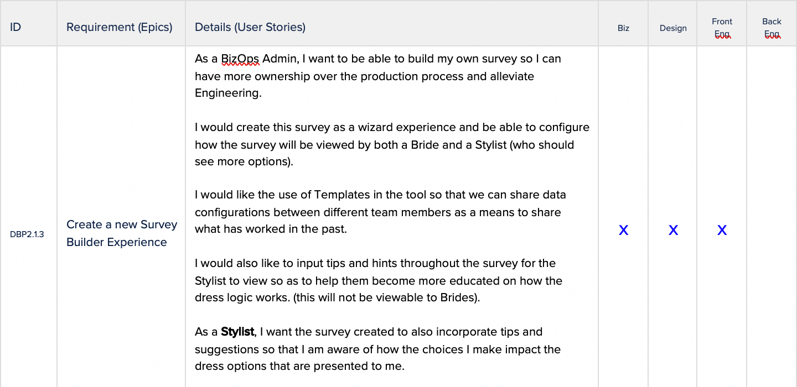
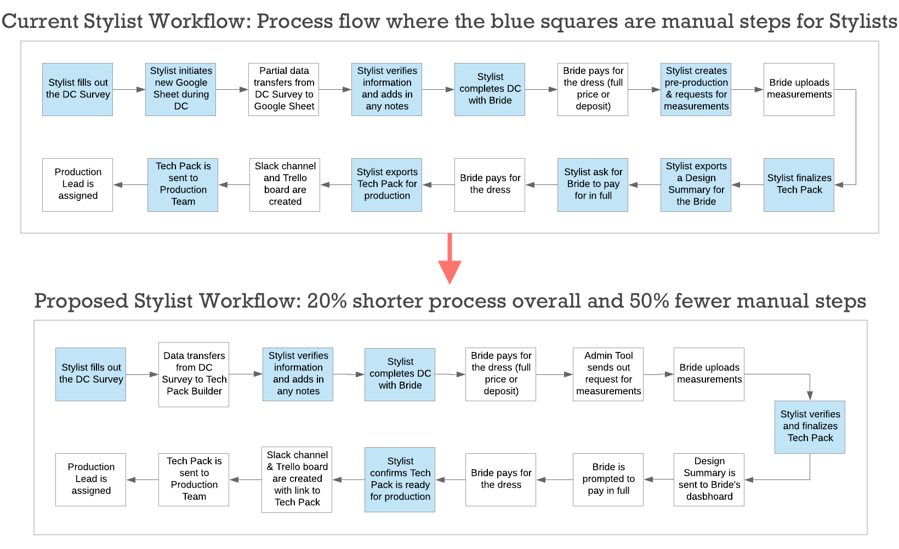
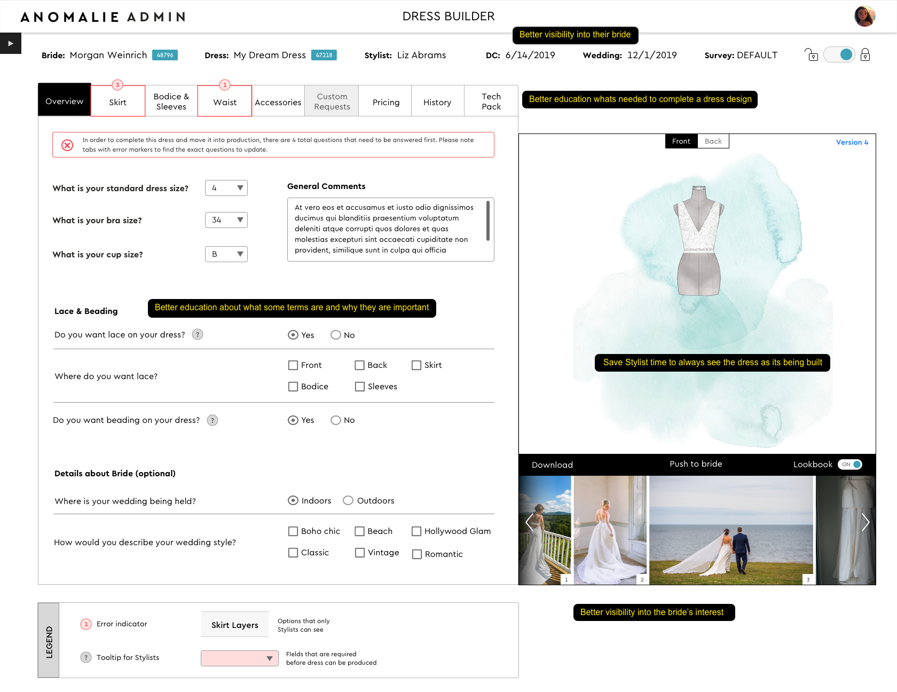
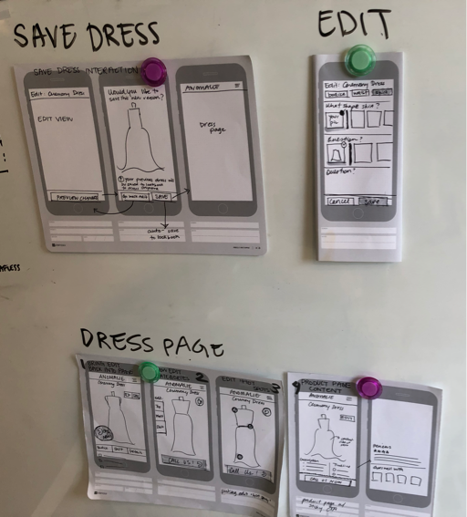
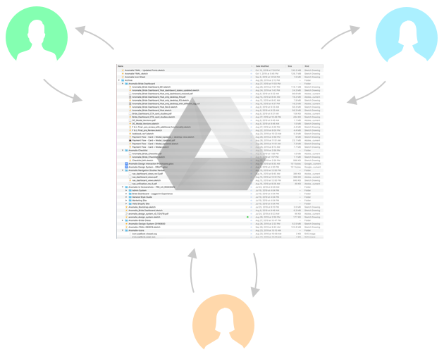
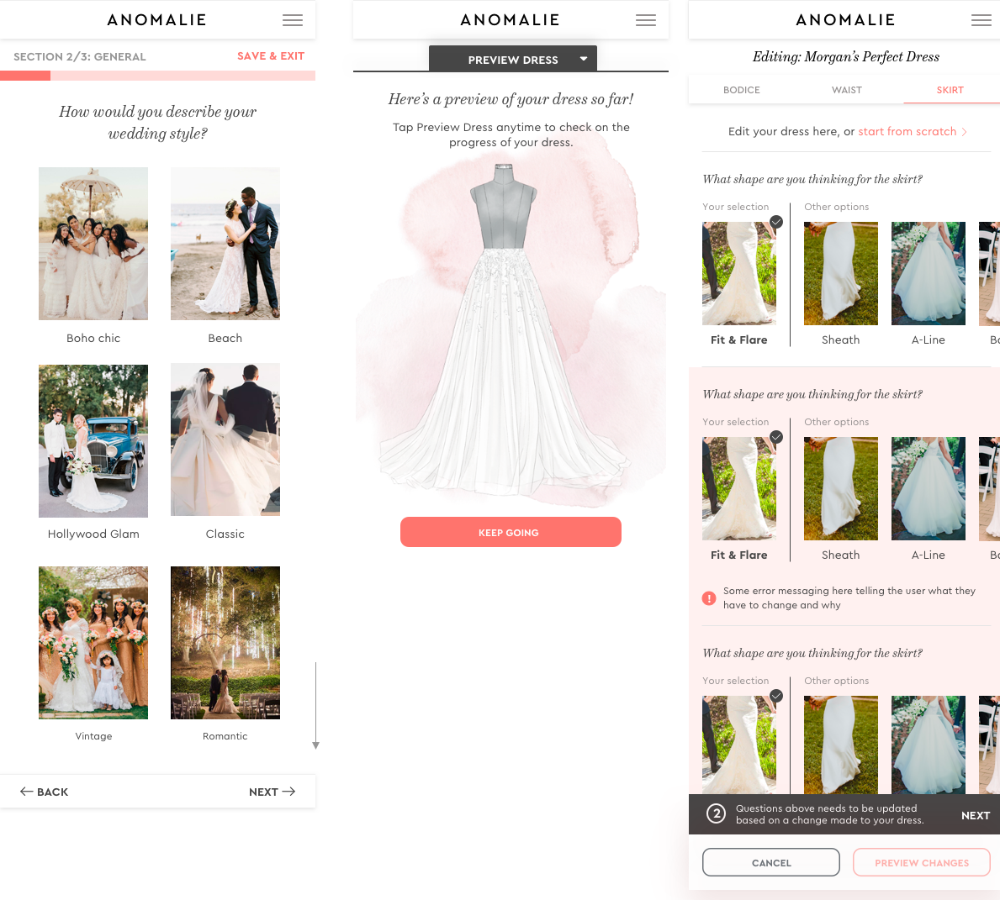
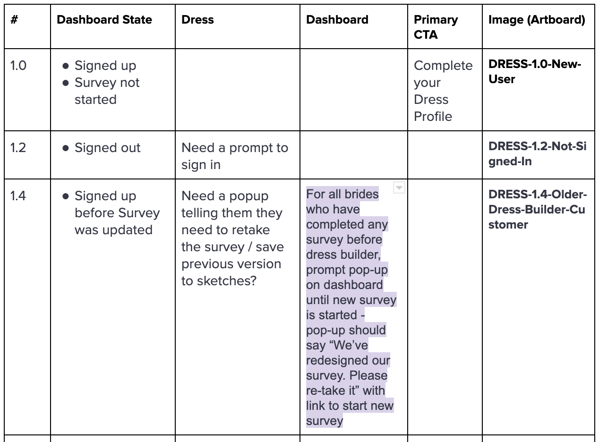
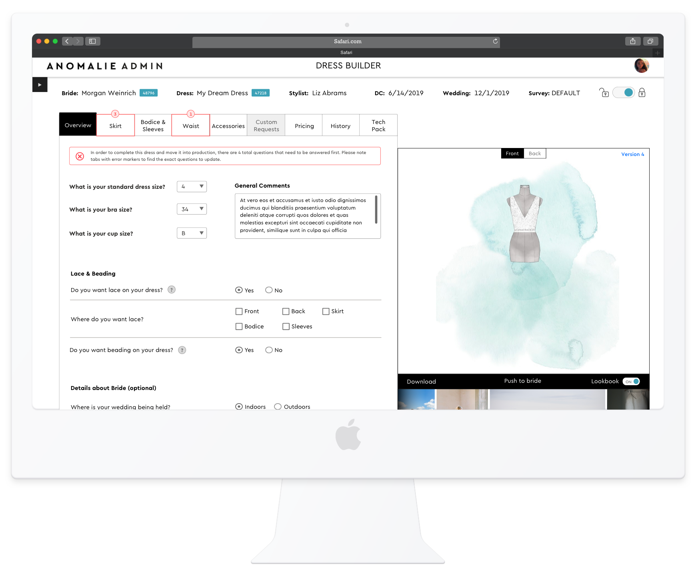
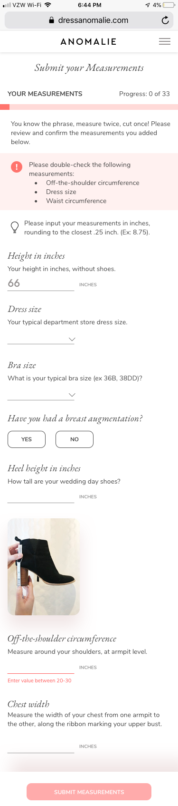

<table>
<tr>
<td></td>
<td></td>
<td></td>
</tr>
</table>

<table class="post-navigation">
<tr>
<td><i class="fab fa-readme"></i> &nbsp;Read the story below</td>
<td><i class="fas fa-angle-double-down"></i> &nbsp;<a href="#spoilers" target="_self">Jump to spoilers</a> </td>
</tr>
</table>

### Background

Weddings have become quite expensive in the United States and wedding dresses have gone up in price along the same trajectory. These dresses are all made in large factories with standard templates and thus the options available to new brides are not very enticing if you want to be unique for your special day. This is where Anomalie comes in to help. They pair brides up with stylists to create bespoke dresses (something that would be a luxury in today's bridal landscape) and provide such a service at bargain prices.

### Problem

Anomalie's products were mostly built ad hoc on an as-needed basis. The company is doing very well but the systems that were put in place are not scalable for the amibition for where it wants to go (beyond just bridal wear to other apparel). They need to build a new platform from the ground up without disrupting the current business engine producing thousands of dresses a month.

### My Involvement

Via Slalom Consulting, I was recruited by Anomalie's Chief Experience Officer to come in and set the foundation for this bold new product initiative. It would involve both product management and product design and I was really excited to take on such a role since it allows me to think along the two main pipelines of bringing a new product to market. I led this iniative that included an internal designer and front-end developer in conjunction on all design efforts as the core team.

&nbsp;

<table class="post-navigation">
<tr>
<td class="half">
	<h6>Cast (Team)</h6>
	<ul class="project-details">
		<li>Product Design Manager (me)</li>
		<li>Lead Designer</li>
		<li>Front-end Developer</li>
		<li>Full Stack Engineer</li>
		<li>CEO</li>
		<li>Chief Experience Officer</li>
	</ul>
</td>
<td class="half">
	<h6>Audience (Users)</h6>
	<ul class="project-details">
		<li>Current Brides</li>
		<li>Future Brides</li>
		<li>Anomalie Bridal Stylists</li>
		<li>Internal Anomalie Admins</li>
		<li>Anomalie Developers</li>
	</ul>
</td>
</tr>
</table>

#### Survey the Landscape

User Research being squeezed is typical within startups since every quarter can make or break the company. My first user is the company itself and so I wanted to get a pulse of the landscape of the executive team and key stakeholders so that I would come to design thinking with some element of knowledge on what the company needs. After 1:1 and group interviews, I came up with the following core focus areas:

> * Internal employees should have a more streamlined process for all their tasks
* Stylists should be bettter equipped to help Brides better to close on a dress
* Brides need a better experience for visualizing and managing their dress

Bullet points are cute but how do they actually translate to work? I wanted to start to think about the actual features that would need to be incorporated. I conducted heurestic reviews of their current product with the help of the team and also uncovered user feedback that has been collected over the years. This was helpful to think about the process and tool portion of the themes listed above but to understand how to build a better consumer experience, I enlisted the team to help me conduct some competitive analysis. This product is fairly unique so we had to stretch into other industries who had really custom planning experiences for their users. 

Some key takeaways that would empower design sessions included the following themes:

> * Make sure the next step you need to take really obvious 
* Global timeline or progress indicator is important 
* Show time estimates for each task
* Incorporate educational content contextually

#### Requirements

I leveraged the above to start to empathize with the users and documentent user stories to be imported into the company's Kanban board. This was inputed into their tool by the Product Manager after each and every one was validated and scoped by the Engineering team as they went through the full lifecycle of the project.

#### Roadshow

I did a mini roadshow, something that may sound silly for a company this size, but I wanted to review all the work done thus far with executives and key stakeholders because I wanted transparency and consensus in the process. This is important since the company is small and every wrong decision can lead a thousand paper cuts.

#### Fork in the design road

There were two core pathways for design: internal users and external users. The Brides portion was far more nebulous so it was decided to do some more research on Brides and proceed with the Stylist and Admin experience. I took on the Stylist experience and delegated the other designer to begin thinking through the consumer side a bit more.

Reviewing the stories that were in place, I broke them down into more detail to identify design approaches:
> * Save Stylists time when doing tasks that can be automated or streamlined
* Stylists should be better at being educated about all things that go into making a dress
* Stylists should have more visibility into what is happening with their brides so they can be the most helpful

I mapped out various process flows to emphasize the changes that would come in place. I believe in thinking macro before dialing into specific individual screens as I want to know where every screen fits into the overall ecosystem.

I went through doing rough wireframes and then validating with the key stakeholder who was my proxy for all internal users. After we had iterated enough times, it was presented to the executives of the company who were quite impressed.

Here is a screen of the final design with some highlights on how the themes were applied:

It was also then put into an Invision prototype and shared with the bigger Operations teams to fabulous feedback. Please check it out here.

[VIDEO OF INVISION PROTOTYPE]

#### The Bridal Experience

The Stylist experience integrates deeply with the Bridal experience so we had some good insight into how to modify the experience. The entire design team created concepts for the Bridal experience and as a truly collaborative effort, we cobbled different portions of our mockups into one beautiful Frankenstien.

We focused on the following themes in our collective designs:

> * Brides should be better educated about what is being asked of them during the survey
* Brides should be able to visualize every customization they want to make about the dress
* Brides should have be able to play with the design as she is creating it

As a team, we had some group design sessions, working via hand sketches to figure out the right flow:

When getting feedback, not everything really sunk in. I pushed to get everything in Invision so we can play it out with the stakeholders. I would have used Figma but the company setup an account on Invision only.

#### Design Rodeo

I managed the design team in terms of executing upon the requirements but there were 3 different resources spread across different locations. Not to mention all the stakeholders who also needed to provide input on design. This led to many many many different versions where we needed to consolidate.

#### Feedback better late than never

> Just when we thought we had come up with good ideas and had established a path for implementation, when we did a final review with Engineering, it was found that we could not do instananeous updates to the dress in real time. We had to pare down this feature as part of the Bridal experience.

Here are a couple of screens of the final design with some highlights on how the themes were applied. There were 100s of screens that were worked on but this is just a sample:

### Sketch is haywire and needs to be reeled in

Since we had over 100 screens, it was hard to understand how it fit into the flow. The Product Manager had a Google doc she used to document features that led to stories. I felt there needed to be some connection between this doc and the Sketch mocks so I renamed each artboard with a schema that can scale with the growing number of screens and mapped each feature to the new name. 

### Resolution

Engineering was able to begin in a very quick turnaround and the design was tested with real users. It was even tested with a user researcher with a PhD in psychology. Ultimately the massive project was smoothly able to be delivered in a timely fashion which was critical to keep the company on track. 

Invsion prototype below:
<iframe width="442" height="935" src="//slalom.invisionapp.com/share/KVTG79ADF7G" frameborder="0" allowfullscreen style="margin:0% 25%"></iframe>

<h3 id="spoilers">Spoilers</h3>

<h4>New Bride Experience</h4>

<h4>Bride Modifying Her Dress</h4>

<h4>Bride managing her Dashboard</h4>

<h4>Bride Uploading Dress Measurements</h4>

<h4>Stylist Managing her Bride's Dress</h4>

<h4>Admins managing Stylists</h4>

