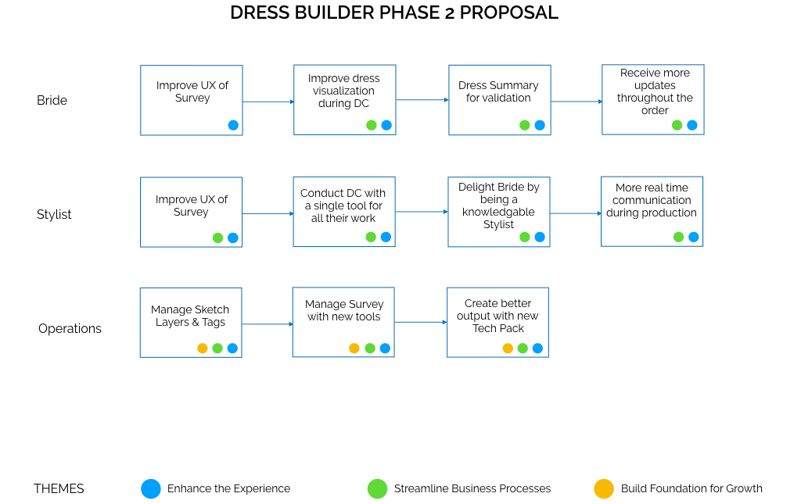
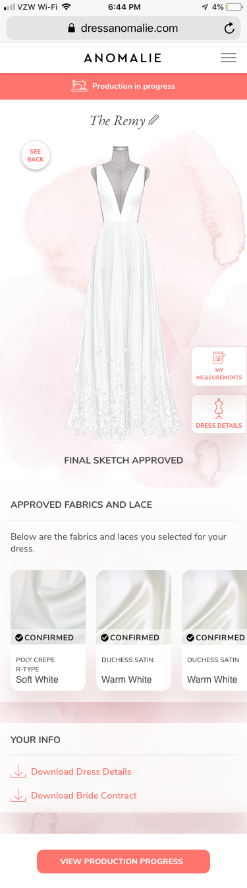

<table>
<tr>
<td></td>
<td></td>
<td></td>
</tr>
</table>

<table class="post-navigation">
<tr>
<td><i class="fab fa-readme"></i> &nbsp;Read the story below</td>
<td><i class="fas fa-angle-double-down"></i> &nbsp;<a href="#spoilers" target="_self">Jump to spoilers</a> </td>
</tr>
</table>

### Background

Weddings have become quite expensive in the United States and wedding dresses have gone up in price along the same trajectory. These dresses are all made in large factories with standard templates and thus the options available to new brides are not very enticing if you want to be unique for your special day. This is where Anomalie comes in to help. They pair brides up with stylists to create bespoke dresses (something that would be a luxury in today's bridal landscape) and provide such a service at bargain prices.

### Problem

Anomalie's products were mostly built ad hoc on an as-needed basis. The company is doing very well but the systems that were put in place are not scalable for the amibition for where it wants to go (beyond just bridal wear to other apparel). They need to build a new platform from the ground up without disrupting the current business engine producing thousands of dresses a month.

### My Involvement

Via Slalom Consulting, I was recruited by Anomalie's Chief Experience Officer to come in and set the foundation for this bold new product initiative. It would involve both product management and product design and I was really excited to take on such a role since it allows me to think along the two main pipelines of bringing a new product to market.

&nbsp;

<table class="post-navigation">
<tr>
<td class="half">
	<h6>Cast (Team)</h6>
	<ul class="project-details">
		<li>Product Design Manager (me)</li>
		<li>Lead Designer</li>
		<li>Front-end Developer</li>
		<li>Full Stack Engineer</li>
		<li>CEO</li>
		<li>Chief Experience Officer</li>
	</ul>
</td>
<td class="half">
	<h6>Audience (Users)</h6>
	<ul class="project-details">
		<li>Current Brides</li>
		<li>Future Brides</li>
		<li>Anomalie Bridal Stylists</li>
		<li>Internal Anomalie Admins</li>
		<li>Anomalie Developers</li>
	</ul>
</td>
</tr>
</table>

#### Survey the Landscape

Limited time for research is typical when startups deal with aggressive timelines. I interviewed all the different managers and key stakeholders to get a sense of the lay of the land within the company so I could understand integration points and came up with the following key subject areas:

[INSERT GRAPHIC OF KEY AREAS FOR DOCUMENTATION]

Adding onto the interviews of internal resources, I conducted heurestic review of their product with internal employees. We also delved into their user feedback and coupled it with competitive research. Some takeaways from those sessions included the following:

[INSERT GRAPHIC OF HAVENLY & STITCH FIX AND FEATURES THAT SHOULD WORK]

#### Requirements are key

I leveraged the above to start to empathize with the users and documentent user stories to be imported into the company's Kanban board. This was inputed into their tool by the Product Manager after each and every one was validated and scoped by the Engineering team.

[BREAK OUT 2-3 STORIES AND DETAIL OUT THE FORMAT OF USING THEM]

#### Roadshow

I did a mini roadshow, something that is silly for a company this size, but reviewed my requirements and notes in a presentation as a means of getting buy-in. I want transparency and consensus in the process. Especially important when the company is small and every decision can have a thousand paper cuts.

#### Design Rodeo

I managed the design team in terms of executing upon the requirements but there were 3 different resources spread across different locations. Not to mention all the stakeholders who also needed to provide input on design. This led to many many many different versions where we needed to consolidate.

[ PROJECT MANAGEMENT SCHEDULE AND RESOURCE MAP ]

#### Start with internal stakeholders

I took on bringing these themes into the designs for the internal stakeholders: Stylists.

Themes:
The theme for stylists was focused around education. Give stylists the ability to be more educated when they help their customers.

[LIST THE THEMES FOR DESIGN AND SHARE SCREENS]

#### End with the brides

I took on bringing these themes into the designs for the external users: Brides.

Themes:
Out of research and heuristics, our main theme for the brides was visibility. Visibility into the dress creation process and the production process once they signed up.

[LIST THE THEMES FOR DESIGN AND SHARE SCREENS]

When getting feedback, not everything really sunk in. I pushed to get everything in Invision so we can play it out with the stakeholders. I would have used Figma but the company setup an account on Invision only.

#### Feedback better late than never

Each iteration of the bride experience had some interaction work tested with the Stylists and some of the employees who were also customers of the company. 

[INSERT SOMETHING THAT CHANGED AND PIVOTED]

### Sketch is haywire and needs to be reeled in

We had over 100 screens and it was hard to understand how it fit into the flow. The Product Manager had Google docs to be used to drive engineering but it was hard to figure out how to map to all those Sketch screens. I combined the docs in a way to be seamless and make handoff easier.

### Resolution

Engineering was able to begin in a very quick turnaround and the design was tested with more users. It was even tested with a user researcher with deep experience in psychology. She provided some feedback which then got applied after the fact.

Invsion prototype below:
<iframe width="442" height="935" src="//slalom.invisionapp.com/share/KVTG79ADF7G" frameborder="0" allowfullscreen></iframe>

<h3 id="spoilers">Spoilers</h3>

